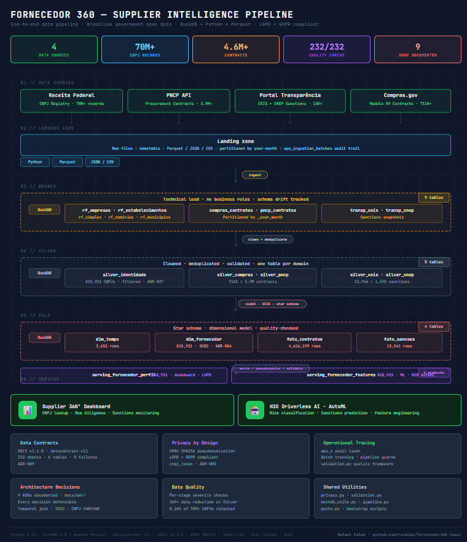

# Fornecedor 360 — Supplier Intelligence Pipeline

**End-to-end data pipeline for Brazilian government supplier intelligence.**

Cross-references four official federal data sources to produce a 360-degree view of public procurement suppliers — covering corporate identity, contract history, and sanctions records — with full data governance, LGPD/GDPR compliance, and documented architectural decisions.

---

## Architecture Overview



```
┌─────────────────────────────────────────────────────────────────────┐
│                          DATA SOURCES                               │
│                                                                     │
│  Receita Federal    PNCP API      Portal Transparência  Compras.gov │
│  (70M+ CNPJs)      (contracts)   (CEIS + CNEP)         (contracts)  │
└───────────┬────────────┬──────────────┬─────────────────┬───────────┘
            │            │              │                 │
            ▼            ▼              ▼                 ▼
┌──────────────────────────────────────────────────────────────────────┐
│                         LANDING ZONE                                 │
│               Raw files — immutable, append-only                     │
│          Parquet / JSON / CSV  ·  ops_ingestion_batches              │
└──────────────────────────────┬───────────────────────────────────────┘
                               │
                               ▼
┌──────────────────────────────────────────────────────────────────────┐
│                          BRONZE LAYER                                │
│      Technical load — no business rules — schema drift tracked       │
│   compras_contratos · pncp_contratos · rf_* · transp_ceis/cnep       │
└──────────────────────────────┬───────────────────────────────────────┘
                               │
                               ▼
┌──────────────────────────────────────────────────────────────────────┐
│                          SILVER LAYER                                │
│      Cleaned, deduplicated, validated — one table per domain         │
│   silver_identidade (810K CNPJs · ADR-007)                           │
│   silver_ceis · silver_cnep · silver_compras · silver_pncp           │
└──────────────────────────────┬───────────────────────────────────────┘
                               │
                               ▼
┌──────────────────────────────────────────────────────────────────────┐
│                           GOLD LAYER                                 │
│           Star schema — dimensional model — quality-checked          │
│   dim_tempo · dim_fornecedor (SCD2) · fato_contratos · fato_sancoes  │
└──────────────────────────────┬───────────────────────────────────────┘
                               │
                               ▼
┌──────────────────────────────────────────────────────────────────────┐
│                          SERVING LAYER                               │
│         Two consumer-aligned outputs (ADR-008)                       │
│   serving_fornecedor_perfil    ·    serving_fornecedor_features      │
│   (dashboard lookups, LGPD)        (ML feature table, H2O)           │
└──────────────────────────────────────────────────────────────────────┘
```

---

## What This Project Demonstrates

| Competency | What was built |
|---|---|
| **Data Engineering** | End-to-end pipeline from raw government files to dimensional model. 4 bootstrap scripts, 7 Bronze notebooks, 3 Silver, 4 Gold, 2 Serving, and ML preparation. All quality checks documented and passing. |
| **Data Architecture** | 9 Architecture Decision Records (ADRs). Star schema with SCD Type 2 on `dim_fornecedor`. Temporal join pattern to prevent stale dimension lookups (ADR-003). |
| **Data Governance** | ODCS v3.1.0 Data Contracts for all Gold and Serving tables — 232 checks passing. LGPD/GDPR-compliant CNPJ pseudonymization via HMAC-SHA256 (ADR-005). Operational traceability via `ops_*` layer. |

---

## Key Engineering Decisions

Every significant technical decision is documented as an explicit, versioned Architecture Decision Record (ADR). Selected examples:

| ADR | Decision | Rationale |
|---|---|---|
| [ADR-001](docs/adr/ADR-001-local-first-development-duckdb.md) | Local-first development with DuckDB | All pipeline logic validated locally before any cloud execution — primary cost control mechanism |
| [ADR-002](docs/adr/ADR-002-cnpj-varchar.md) | CNPJ stored as `VARCHAR` | Brazilian government is migrating CNPJ to alphanumeric format in July 2026 — `INTEGER` would break ingestion |
| [ADR-003](docs/adr/ADR-003-temporal-join-dim-fornecedor.md) | Temporal join on `dim_fornecedor` — never `is_current = true` alone | Prevents incorrect attribute attribution when a supplier changes state between contract signature and analysis date |
| [ADR-004](docs/adr/ADR-004-scd2-hash-change-detection.md) | SCD Type 2 with MD5 hash change detection | Hash over tracked attributes enables efficient change detection without field-by-field comparison |
| [ADR-005](docs/adr/ADR-005-hmac-sha256-cnpj-pseudonymization.md) | HMAC-SHA256 pseudonymization for CNPJ | MEI and EI CNPJs uniquely identify natural persons — personal data under LGPD. Bare SHA-256 is brute-forceable over the 14-digit space |
| [ADR-007](docs/adr/ADR-007-silver-identidade-filtered-cnpjs.md) | `silver_identidade` filtered to active CNPJs only | Only 0.26% of the 70M+ Receita Federal CNPJs appear in contracts or sanctions — 369× reduction enables local pipeline execution |

Full ADR catalogue in [`docs/adr/`](docs/adr/).

---

## Data Sources

| Source | What it provides | Volume |
|---|---|---|
| [Receita Federal](https://www.gov.br/receitafederal/pt-br) | CNPJ registry — corporate identity, legal nature, status, address | 70M+ records |
| [PNCP](https://www.gov.br/pncp/pt-br) | National procurement portal — contracts from 2021 onwards | 3.9M+ contracts |
| [Compras.gov](https://www.compras.gov.br) | Federal procurement contracts — detailed supplier and buyer data | 711K+ contracts |
| [Portal da Transparência](https://portaldatransparencia.gov.br) | CEIS and CNEP — federal sanctions and penalties registry | 15K+ sanctions |

---

## Pipeline Scale

| Table | Rows | Description |
|---|---|---|
| `rf_estabelecimentos` | 70M+ | Full Receita Federal establishment registry (Bronze) |
| `silver_identidade` | 810,921 | Active suppliers — CNPJs present in contracts or sanctions |
| `dim_fornecedor` | 810,921 | Supplier dimension with SCD Type 2 historization |
| `fato_contratos` | 4,616,199 | Procurement contracts fact table |
| `fato_sancoes` | 15,541 | Sanctions fact table |
| `serving_fornecedor_perfil` | 810,921 | Dashboard-ready supplier profiles |
| `serving_fornecedor_features` | 810,921 | ML feature table for risk classification |

---

## Data Quality

Every pipeline stage has explicit quality checks with documented severity, action, and expected behaviour. The Gold and Serving layers are additionally governed by ODCS v3.1.0 Data Contracts validated with `datacontract-cli`:

```bash
datacontract test contracts/gold/dim_fornecedor.odcs.yaml
# 🟢 data contract is valid. Run 28 checks. Took 1.52s.

datacontract test contracts/serving/serving_fornecedor_perfil.odcs.yaml
# 🟢 data contract is valid. Run 50 checks. Took 1.66s.
```

**6 contracts · 232 checks · 0 failures.**

---

## LGPD / GDPR Compliance

Brazil's Lei Geral de Proteção de Dados (LGPD) — aligned with the EU General Data Protection Regulation (GDPR) — classifies MEI and EI CNPJs as personal data because they uniquely identify natural persons.

This pipeline implements three controls:

- **HMAC-SHA256 pseudonymization** — all CNPJ fields exposed in the Serving layer are replaced with `cnpj_token`, a deterministic and irreversible token. The salt is loaded exclusively from environment variables — never stored in code, logs, or the repository.
- **Data minimization at Silver** — `silver_identidade` retains only CNPJs with documented procurement or sanctions activity (0.26% of the full registry).
- **No raw CNPJ in Serving** — consumers receive `cnpj_token` only, not the original identifier.

See [ADR-005](docs/adr/ADR-005-hmac-sha256-cnpj-pseudonymization.md) for the full pseudonymization rationale and `utils/privacy.py` for the implementation.

---

## Repository Structure

```
supplier-360-pipeline/
│
├── contracts/                   # ODCS v3.1.0 Data Contracts (validated)
│   ├── gold/                    # dim_tempo, dim_fornecedor, fato_contratos, fato_sancoes
│   └── serving/                 # serving_fornecedor_perfil, serving_fornecedor_features
│
├── docs/
│   ├── adr/                     # 9 Architecture Decision Records (ADR-001 to ADR-009)
│   └── architecture/            # Pipeline architecture diagram
│
├── notebooks/
│   ├── 01–04_bootstrap_*.py     # Data acquisition — Landing zone
│   ├── 05_landing_validate      # Landing gate quality checks
│   ├── 06–12_bronze_*.ipynb     # Bronze layer — 7 source domains
│   ├── 13–15_silver_*.ipynb     # Silver layer — 3 domain notebooks
│   ├── 16–19_gold_*.ipynb       # Gold layer — dimensions + facts
│   ├── 20–21_serving_*.ipynb    # Serving layer — 2 consumer outputs
│   ├── 22–23_*.ipynb            # ML feature preparation
│   ├── eda/                     # Exploratory analysis notebooks
│   └── ops/                     # Operational runbooks
│
├── utils/                       # Shared Python utilities
│   ├── privacy.py               # HMAC-SHA256 CNPJ pseudonymization
│   ├── validation.py            # Quality check framework
│   ├── duckdb_utils.py          # SQL expression helpers
│   ├── pipeline.py              # Landing gate + pipeline guards
│   └── paths.py                 # Project root resolution
│
├── requirements.txt
└── README.md
```

---

## Running Locally

### Prerequisites

- Python 3.11+
- Git

### Setup

```bash
git clone https://github.com/rscaldo/supplier-360-pipeline.git
cd supplier-360-pipeline

python -m venv .venv
source .venv/bin/activate        # Linux / macOS
# .venv\Scripts\activate         # Windows

pip install -r requirements.txt
```

### Environment

Create `.env` in the project root (never committed):

```bash
CNPJ_SALT=<64-char random hex>
# Generate with: python -c "import secrets; print(secrets.token_hex(32))"
```

### Data Acquisition

The Receita Federal dataset (~4.5 GB/month) requires a Nextcloud/WebDAV share token from SERPRO. The remaining three sources are publicly available APIs with no authentication required:

```bash
python notebooks/01_bootstrap_receita_federal.py   # ~4.5 GB — requires RECEITA_FEDERAL_SHARE_TOKEN
python notebooks/02_bootstrap_pncp.py              # public API
python notebooks/03_bootstrap_transparencia.py     # public API
python notebooks/04_bootstrap_compras.py           # public API
```

### Pipeline Execution

Run notebooks sequentially using Jupyter or VS Code:

```
05 → 06–12 (Bronze) → 13–15 (Silver) → 16–19 (Gold) → 20–21 (Serving) → 22–23 (ML)
```

### Validate Data Contracts

```bash
pip install 'datacontract-cli[duckdb]'

datacontract test contracts/gold/dim_tempo.odcs.yaml
datacontract test contracts/gold/dim_fornecedor.odcs.yaml
datacontract test contracts/gold/fato_contratos.odcs.yaml
datacontract test contracts/gold/fato_sancoes.odcs.yaml
datacontract test contracts/serving/serving_fornecedor_perfil.odcs.yaml
datacontract test contracts/serving/serving_fornecedor_features.odcs.yaml
```

---

## Key Technical Lessons

Documented in full in [`docs/adr/`](docs/adr/). Selected learnings from production-scale data:

- **DuckDB memory management** — Multiple blocking operators (`ROW_NUMBER()` + hash join) over large tables in a single query cause `OutOfMemoryException`. Solution: separate into independent `CREATE TABLE` statements.
- **Surrogate key without global sort** — `ROW_NUMBER() OVER (ORDER BY ...)` over 810K rows causes OOM. Solution: `MD5(cnpj_normalized || valid_from)` as a deterministic, sort-free surrogate key.
- **CNPJ data quality** — 406 PNCP records with `tipoPessoa='PJ'` contained CPF (11-digit) identifiers. Filter: `AND length(niFornecedor) = 14`.
- **Portal da Transparência pagination** — API returns an empty body (not an empty list) past the last page. Requires `if not resp.text.strip()` guard.
- **latin-1 strict validation** — DuckDB applies strict ISO-8859-1 validation. The Receita Federal establishment file (~5 GB) contains C1 control bytes (`0x80–0x9F`) that are invalid in strict latin-1 and must be sanitized before ingestion.
- **DuckDB global regex flag** — `REGEXP_REPLACE` replaces only the first match by default. Use the `'g'` flag for global replacement.

---

## Tech Stack

| Layer | Technology |
|---|---|
| Data processing | Python 3.11, DuckDB 1.0, pandas |
| Storage format | Parquet (partitioned by year-month), JSON |
| Data contracts | datacontract-cli 0.12.2, ODCS v3.1.0 |
| Quality framework | Custom check framework (`validation.py`) |
| Privacy | HMAC-SHA256 (`hmac`, `hashlib`) |

---

## License

This project uses exclusively public government data sources. All data is sourced from official Brazilian federal government APIs and portals under open data policies.

Code is released under the MIT License.
